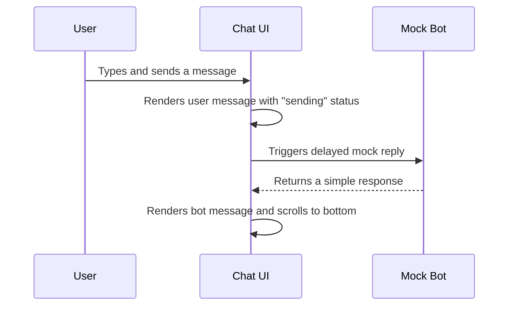
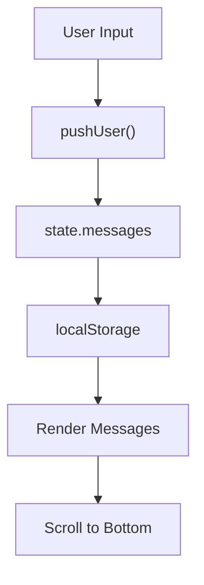
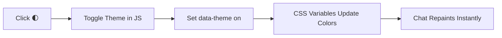
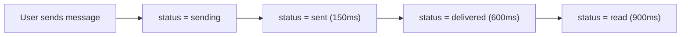
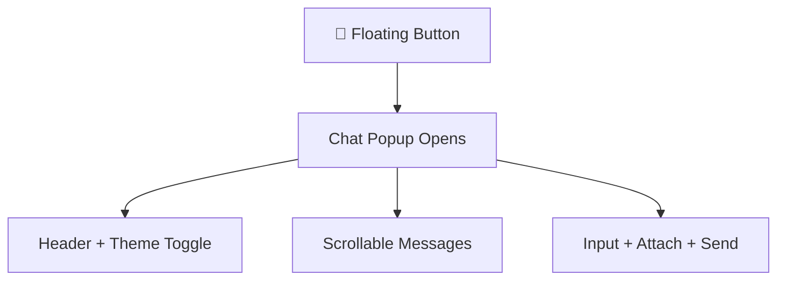

# 🧠 Pidima Chat (Vanilla JS)

A lightweight, responsive **chat interface** built using **pure HTML, CSS, and JavaScript** — designed to easily integrate with **Pidima’s AI-powered documentation tools**.

---

## 🎯 Objective

Create a standalone chat experience that **could integrate** with an AI API later, while remaining fully functional offline using mock responses.

---

## 🧩 Core Features

✅ Message input and display  
✅ Scrollable message history  
✅ Timestamps per message  
✅ Smooth message animations  
✅ Responsive mobile & desktop layout  
✅ Theme toggle (light / dark)  
✅ Typing indicator (animated dots)  
✅ Local storage message persistence  

---

## 🗂️ Folder Structure
```
project/
├── index.html # Markup (chat launcher, dialog, input area)
├── styles.css # Layout, themes, animations
└── app.js # Chat logic, event handling, mock AI
```


---

## 💬 Chat Flow Diagram



---


## 🧠 State Management


---


## 🎨 Theming Logic

The theme is stored in localStorage and toggled via a button.


---


## ⚙️ Key JS Concepts
| Feature                                                    | Description                                |
| ---------------------------------------------------------- | ------------------------------------------ |
| `document.documentElement.setAttribute('data-theme', ...)` | Updates the global theme                   |
| `requestAnimationFrame()`                                  | Ensures smooth scroll after new messages   |
| `.trim()`                                                  | Removes extra spaces from user input       |
| `escapeHtml()`                                             | Prevents XSS by sanitizing message content |
| `localStorage`                                             | Saves chat history persistently            |


---


## 🧩 Mock Bot Logic

A simple mock function simulates AI replies:

```
function simpleReply(t) {
  const low = t.toLowerCase();
  if (low.includes('hello')) return 'Hello! How can I help you today?';
  if (low.includes('doc')) return 'Docs tip: try “search pagination limits”.';
  return `You said: "${t}" (mock reply)`;
}
```

---


## ⚡ Message Status Update Flow


Each update modifies only the message status text, not the entire chat list — ensuring smooth transitions.

---


## 🧑‍💻 Integration Readiness

Although this version uses mock data, it’s structured to integrate easily with Pidima’s real API:
```
async function sendMessageToPidima(text) {
  const res = await fetch('https://api.pidima.ai/chat', {
    method: 'POST',
    headers: { 'Content-Type': 'application/json' },
    body: JSON.stringify({ message: text })
  });
  const data = await res.json();
  return data.reply;
}
```
You’d just swap out the mockBot() call for this function.


---


## 📱 Responsive Layout Preview


---


## 🧠 Accessibility Highlights

- role="dialog" and aria-hidden toggle screen reader visibility
- aria-live="polite" announces new messages
- Keyboard shortcuts:
    - Enter = Send message
    - Shift + Enter = New line
    - Esc = Close chat


---


## 🧰 Tech Stack
| Technology           | Purpose                            |
| -------------------- | ---------------------------------- |
| **HTML5**            | Structure                          |
| **CSS3**             | Layout, colors, animations         |
| **JavaScript (ES6)** | Logic, persistence, event handling |
| **LocalStorage API** | Chat history                       |
| **ARIA roles**       | Accessibility                      |

---

## 🧾 Assumptions

- The chat runs locally (no backend).
- Messages persist locally between sessions.
- Future integration will connect via a REST or streaming API.
- Works on modern browsers (Chrome, Firefox, Safari).
